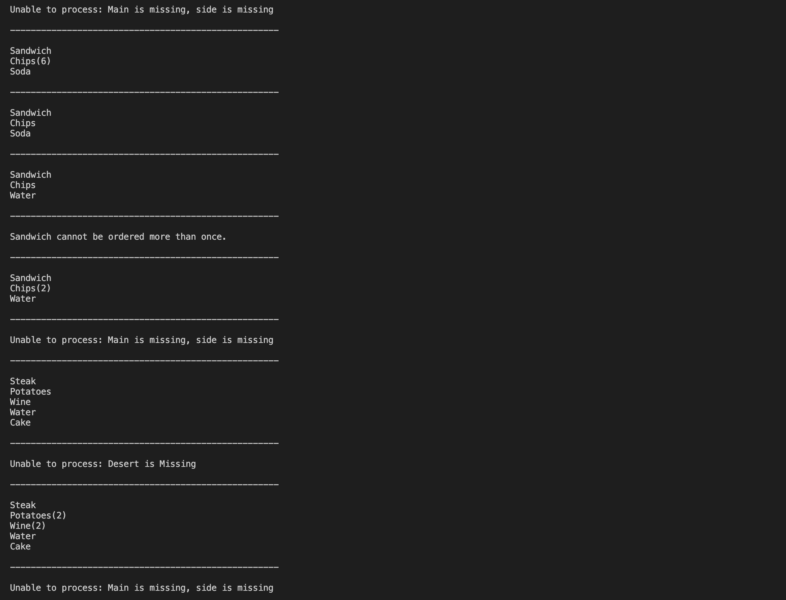

# Evive-Test

# Problem Description
In the given problem I had to build a system that takes orders of breakfast, lunch and dinner. The menus of the breakfast, lunch and dinner were given.
The order was given by the customer in the format of Breakfast 1,2,3 where Breakfast indicated that the customer had ordered breakfast and 1 indicated the main dish, 2 indicated side dish and 3 indicated drink.

There were several rules that were to be followed while designing the system. They were as follows:
1. An order consists of a meal and collection of comma separated item Ids.
2. The system should return the name of the items ordered
3. The system should always return items in the following order: meal, side, drink
4. If multiple items are ordered, the number of items should be indicated
5. Each order must contain a main and a side
6. If no drink is ordered, water should be returned
7. At breakfast, multiple cups of coffee can be ordered
8. At lunch, multiple sides can be ordered
9. At dinner, dessert must be ordered
10. At dinner, water is always provided

# Approach to the given problem
For this problem I used the python programming language. I created a class called **FoodOrderSystem** which consisted of two functions named **check_rules** and **make_menu**. In the check_rules function I defined all the rules that were to be followed while ordering. I was able to use the same function for breakfast, lunch and dinner because most of the rules were similar and hence to avoid repitition of the code I created a single function which can check rules for all the three things i.e. Breakfast, lunch and dinner. Only dinner contained some extra rules that I handled by passing the item name to this function. The function check_rules was used to create the given menu. I used dictionary for creating a menu for breakfast, lunch and dinner. 

# Working Solution Screenshot

